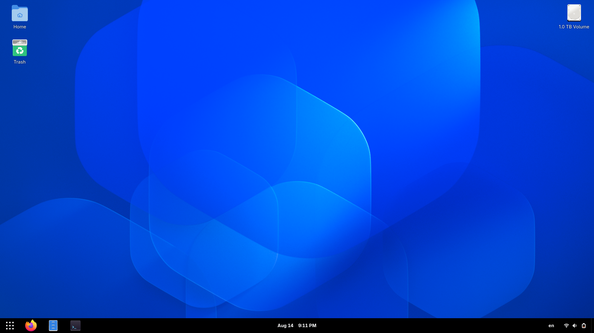

# gxthemer

A GNOME extensions theming tool.

## Usage

Clone and enter the repository:

```
git clone https://github.com/ahmedz4de/gxthemer.git
cd gxthemer/src/
```

Execute the script:

```
bash gxthemer.sh COMMAND [ARGS...]
```

Commands:
```
uninstall-extensions                 uninstalls all user-installed extensions
save-theme                           saves extension names and settings to a directory with the specified name
apply-theme                          calls uninstall-extensions, then applies a specified theme
```

Example usage:
```
bash gxthemer.sh apply-theme ahmedz4de
```
This will uninstall all user-installed extensions, install extensions specified in `/themes/ahmedz4de/extensions.txt` (You will need to confirm their installation) and import settings from `/themes/ahmedz4de/dconf.txt`. 


## Themes
Name: `ahmedz4de`



Extensions:
`Dash To Panel`
`Blur my Shell`
`Vertical App Grid`
`Desktop Icons NG (DING)`
`AppIndicator and KStatusNotifierItem Support`
`Caffeine`
